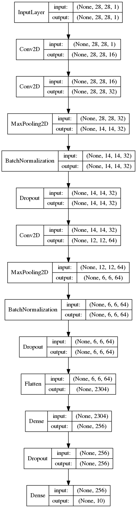

# Fashion-MNIST

CNN architecture and  parameters tuning for Fashion MNIST dataset  

Five CNN architectures were implemented. The best one, **Conv2Dsimple2**  has two convolutional layers (followed by maxpooling, batch normalization and 25% dropout respectively) and two fully connected layers (followed by 25% dropout). Achieved test accuracy is **93.6%** for a network with **0.6M** parameters.  

# Conv2Dsimple2 test metrics

  

*Shirt* class is the hardest to learn for this classifier. Both miss rate (derived from recall) and precision are minimal for this class.

# Conv2Dsimple2 10-class confusion matrix on test set

  

Here is provided a somewhat better level of comprehension behind metrics (rows are classifier's prediction, columns represents the ground truth): *shirt* and *top* are mixed most often. Setting class weights to a higher value for this classifier does not do much good - it decreases recall. The incapacity to distinguish between these two classes is the main drawback of *Conv2Dsimple2*.

# Conv2Dsimple2 architecture

  

# CNN architecture choices and motivation:

*	First, *Conv2Dnet* (3.2M parameters) was built after a research on the subject, from publicly available models listed on benchmarks on the Fashion-MNIST github page. Inspiration was fairly high test set accuracy (>93%) given small number of convolutional layers (up to two) and small number of parameters (~2M). The drawback of this architecture is limited capacity to learn the train data (plateauing very early into training).  

* Second, *InceptionCNN* (20.1M parameters) was implemented, a shallow CNN representing only one Inception block of this popular architecture (GoogLeNet). Reason was that I wanted try out multiple convolutional blocks with different filter sizes and max pooling and to see whether this might increase both train and validation accuracies. Indeed, network had >99.5% accuracy on train data, but really low validation accuracy (92.7%) -> overfitting.  

* Third, *Conv2Dsimple* (0.4M parameters) was a test build, as I wanted to see whether I can use the 1D convolution followed immediately by 2D convolution approach (convolutional layer with dimensionality reduction, or “network in network”) from Inception module and still get decent results. Indeed, train accuracy was still low but the network performs well enough on test set – 92.8% accuracy.  
*	After that, *Conv2Dsimple2* (0.6M parameters) and *Conv2Dsimple3* (5.6M parameters) architectures were built by stacking an another convolutional layer with dimensionality reduction, first having smaller amount of filters. Second has also an additional fully connected layer. Training/validation accuracies were {96%, 98%}/{93%, 93.8%} while test set accuracies were 93.6%/93.9% respectively (Conv2Dsimple2 order-first).  
